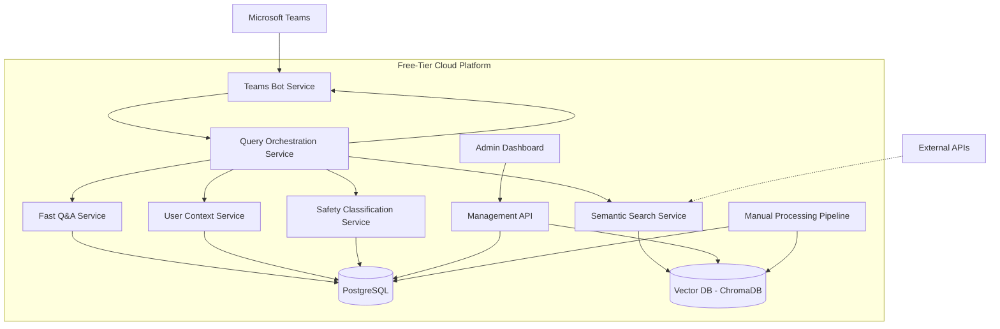
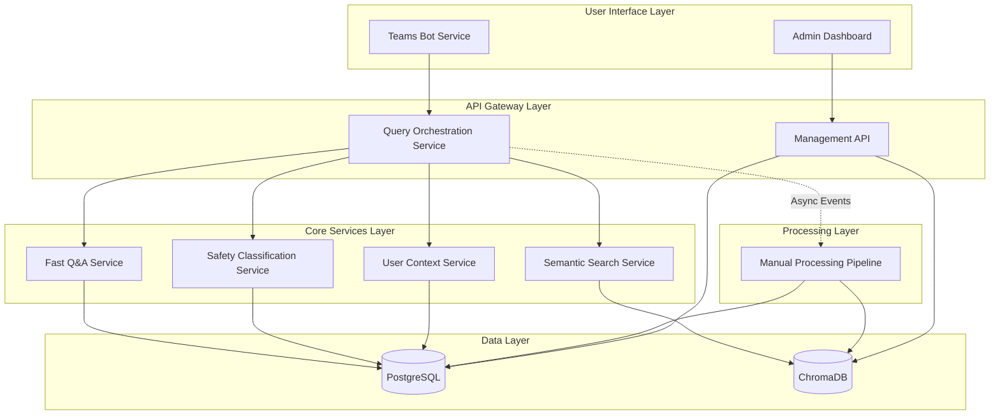
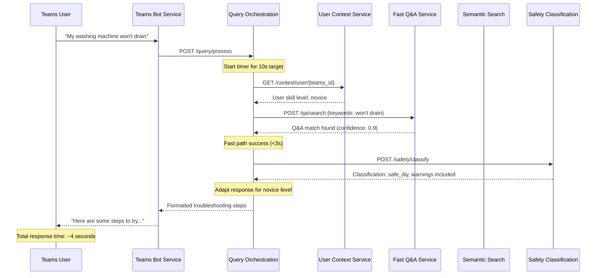
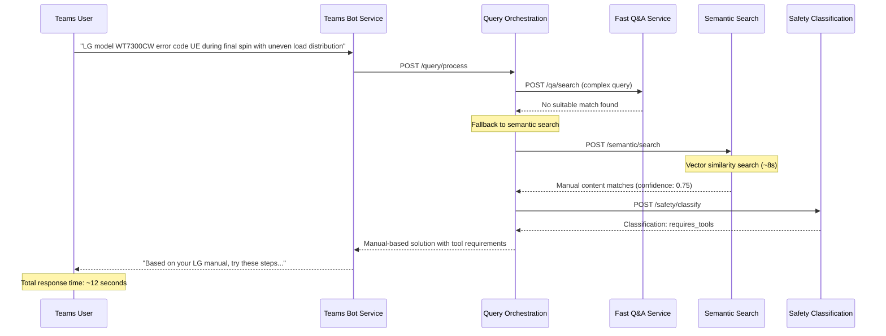
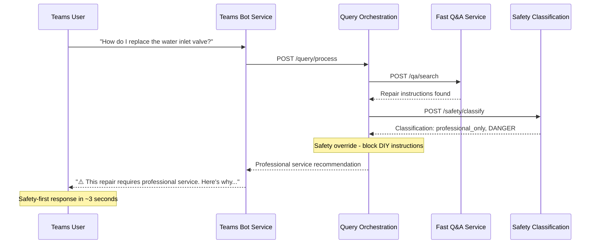

# RAG-Powered Washing Machine Troubleshooting Assistant Architecture Document

## Introduction

This document outlines the overall project architecture for **RAG-Powered Washing Machine Troubleshooting Assistant**, including backend systems, shared services, and non-UI specific concerns. Its primary goal is to serve as the guiding architectural blueprint for AI-driven development, ensuring consistency and adherence to chosen patterns and technologies.

**Relationship to Frontend Architecture:**
Since the project includes a significant user interface (Microsoft Teams bot integration), a separate Frontend Architecture Document will detail the frontend-specific design and MUST be used in conjunction with this document. Core technology stack choices documented herein are definitive for the entire project, including any frontend components.

### Starter Template or Existing Project

**Decision:** The project will leverage existing Microsoft Teams Bot Framework scaffolding and FastAPI project templates for rapid setup while maintaining architectural consistency with PRD requirements.

**Rationale:** Using official Microsoft Bot Framework templates and FastAPI project generators provides faster time-to-market, established best practices, and community support while allowing customization for our specific troubleshooting requirements.

**Implementation:** N/A - No specific starter template dependency, using framework-native scaffolding tools.

### Change Log

| Date | Version | Description | Author |
|------|---------|-------------|---------|
| 2025-09-05 | v1.0 | Initial architecture document creation | Winston (Architect) |

## High Level Architecture

### Technical Summary

The RAG-Powered Washing Machine Troubleshooting Assistant employs a **microservices-within-monorepo architecture** utilizing a tiered search strategy combining fast Q&A lookup with semantic manual search fallback. The system leverages **FastAPI** for high-performance async backend services, **PostgreSQL** for structured data with vector embedding support, and **ChromaDB** for semantic search capabilities. Core architectural patterns include **Repository Pattern** for data abstraction, **Strategy Pattern** for search orchestration, and **Circuit Breaker Pattern** for external API resilience. This architecture directly supports PRD goals of sub-10 second response times, 85% accuracy rates, and seamless Microsoft Teams integration while operating within free-tier infrastructure constraints.

### High Level Overview

1. **Architectural Style:** **Microservices within Monorepo** - Separate services for search, user context, safety classification, and bot management while maintaining deployment simplicity and free-tier optimization
2. **Repository Structure:** **Monorepo** as specified in PRD - Single repository containing Teams bot, API backend, manual processing pipeline, and admin interface for simplified dependency management and CI/CD
3. **Service Architecture:** **Event-driven microservices** with REST API communication and shared PostgreSQL data layer, enabling independent scaling while maintaining deployment simplicity
4. **Primary User Flow:** Teams user query → Bot Framework → Query orchestration → Tiered search (Fast Q&A → Semantic fallback) → Safety classification → Contextual response adaptation → Teams response
5. **Key Architectural Decisions:**
   - **Tiered Search Strategy:** Fast Q&A lookup (sub-5 seconds) with semantic search fallback (15 seconds) to balance speed and coverage
   - **Safety-First Design:** All responses pass through safety classification before delivery to users
   - **Context-Aware Responses:** User skill level detection drives response complexity and safety warning emphasis

### High Level Project Diagram



### Architectural and Design Patterns

- **Microservices Architecture:** Independent services for search, safety, context management - *Rationale:* Enables independent scaling of compute-intensive search operations while maintaining deployment simplicity for free-tier constraints

- **Repository Pattern:** Abstract data access logic across PostgreSQL and vector databases - *Rationale:* Enables testing isolation, database migration flexibility, and consistent data access patterns across microservices

- **Strategy Pattern:** Pluggable search algorithms (fast Q&A vs semantic search) - *Rationale:* Supports PRD requirement for tiered search approach and enables A/B testing different search strategies

- **Circuit Breaker Pattern:** Resilient external API calls with fallback mechanisms - *Rationale:* Ensures sub-10 second response times even when external services fail, maintaining system availability

- **Command Query Responsibility Segregation (CQRS):** Separate read/write models for user analytics vs. real-time queries - *Rationale:* Optimizes query performance for sub-10 second target while enabling comprehensive analytics tracking

- **Adapter Pattern:** Standardized interfaces for multiple vector databases (ChromaDB/Weaviate) - *Rationale:* Provides flexibility to switch vector databases based on free-tier availability and performance benchmarks

## Tech Stack

This is the **DEFINITIVE** technology selection section that serves as the single source of truth for all development decisions.

### Cloud Infrastructure
- **Provider:** Railway (Primary) with Render as backup option
- **Key Services:** PostgreSQL hosting, container deployment, environment management  
- **Deployment Regions:** US-East (closest to Microsoft Teams data centers)

### Technology Stack Table

| Category | Technology | Version | Purpose | Rationale |
|----------|------------|---------|---------|-----------|
| **Language** | Python | 3.11 | Primary development language | Modern async features, FastAPI optimization, strong typing |
| **Runtime** | Python | 3.11.5 | Application runtime | LTS stability, performance improvements |
| **Backend Framework** | FastAPI | 0.104.1 | REST API and async services | High performance, automatic OpenAPI, async support |
| **Database** | PostgreSQL | 15.4 | Primary data storage | JSON support, reliability, free-tier availability |
| **Vector Database** | ChromaDB | 0.4.15 | Semantic search storage | Python-native, simple deployment, open-source |
| **ORM** | SQLAlchemy | 2.0.23 | Database abstraction | Async support, migration tools, FastAPI compatibility |
| **Teams Integration** | Bot Framework SDK | 4.15.0 | Microsoft Teams interface | Official SDK, conversation state, adaptive cards |
| **Frontend Framework** | React | 18.2.0 | Admin dashboard UI | Component ecosystem, team expertise |
| **Build Tool** | Vite | 4.5.0 | Frontend build system | Fast HMR, modern tooling, optimized builds |
| **Embeddings** | sentence-transformers | 2.2.2 | Text embeddings for search | Open-source, no API costs, proven performance |
| **HTTP Client** | httpx | 0.25.0 | Async HTTP requests | FastAPI compatibility, async support |
| **Authentication** | Microsoft Graph SDK | 1.2.0 | Teams SSO integration | Official SDK, secure token handling |
| **Testing Framework** | pytest | 7.4.3 | Unit and integration testing | Async support, fixtures, extensive plugins |
| **Code Quality** | ruff | 0.1.5 | Linting and formatting | Fast, comprehensive, replaces multiple tools |
| **Deployment** | Railway | Latest | Cloud platform | Git-based deployment, PostgreSQL, free tier |
| **CI/CD** | GitHub Actions | Latest | Automated pipeline | Free for public repos, Docker support |
| **Monitoring** | Better Stack | Free Tier | Uptime and error tracking | Free tier, simple setup, good alerting |

## Data Models

### User
**Purpose:** Represents Teams users with persistent context and preferences for personalized troubleshooting experiences

**Key Attributes:**
- `id`: UUID - Primary identifier
- `teams_user_id`: String - Microsoft Teams user identifier
- `skill_level`: Enum(novice, diy_enthusiast, renter) - Detected/selected skill level
- `preferences`: JSONB - User preferences and constraints
- `created_at`: DateTime - Account creation timestamp
- `last_active`: DateTime - Last interaction timestamp

**Relationships:**
- One-to-many with QuerySession (user conversation history)
- One-to-many with UserFeedback (response ratings and success tracking)

### QuerySession
**Purpose:** Tracks individual troubleshooting conversations with context and outcome measurement

**Key Attributes:**
- `id`: UUID - Primary identifier
- `user_id`: UUID - Foreign key to User
- `initial_query`: Text - Original user question
- `conversation_context`: JSONB - Full conversation thread
- `search_strategy_used`: Enum(fast_qa, semantic, hybrid) - Search method employed
- `response_time_ms`: Integer - Total response time for performance tracking
- `resolution_status`: Enum(resolved, escalated, abandoned) - Session outcome
- `created_at`: DateTime - Session start time

**Relationships:**
- Many-to-one with User (session owner)
- One-to-many with QueryResponse (individual responses in conversation)

### QAEntry
**Purpose:** Curated fast-lookup troubleshooting solutions for common washing machine issues

**Key Attributes:**
- `id`: UUID - Primary identifier  
- `question`: Text - Standardized question format
- `answer`: Text - Structured troubleshooting steps
- `keywords`: Array[String] - Search keywords for matching
- `supported_models`: Array[String] - Compatible washing machine models
- `safety_level`: Enum(safe, caution, professional) - DIY safety classification
- `complexity_score`: Integer(1-10) - Technical complexity rating
- `success_rate`: Float - Historical effectiveness percentage
- `created_at`: DateTime - Entry creation time
- `updated_at`: DateTime - Last modification time

**Relationships:**
- One-to-many with QueryResponse (when fast Q&A is used)
- Many-to-many with ManufacturerModel (supported machines)

### ManualContent
**Purpose:** Processed manufacturer manual sections for semantic search and comprehensive coverage

**Key Attributes:**
- `id`: UUID - Primary identifier
- `manufacturer`: String - Washing machine manufacturer  
- `model_series`: String - Applicable model series
- `section_title`: String - Manual section heading
- `content`: Text - Processed manual text
- `embedding`: Vector - Semantic search embedding
- `content_type`: Enum(troubleshooting, maintenance, safety, warranty) - Content category
- `confidence_score`: Float - Content quality/relevance score
- `source_manual`: String - Original manual reference
- `page_reference`: String - Original page/section reference

**Relationships:**
- One-to-many with QueryResponse (when semantic search is used)
- Many-to-one with ManufacturerModel (applicable machines)

### SafetyClassification
**Purpose:** Safety assessment rules and audit trail for professional vs. DIY repair recommendations

**Key Attributes:**
- `id`: UUID - Primary identifier
- `repair_type`: String - Type of repair or maintenance
- `safety_level`: Enum(safe_diy, requires_tools, professional_only, dangerous) - Safety classification
- `reasoning`: Text - Explanation of safety assessment
- `required_tools`: Array[String] - Tools needed for safe completion
- `skill_requirements`: Array[String] - Required technical skills
- `warning_text`: Text - Standardized safety warning
- `created_at`: DateTime - Rule creation time

**Relationships:**
- One-to-many with QueryResponse (safety assessments applied)

### QueryResponse
**Purpose:** Individual responses delivered to users with full context for accuracy tracking and improvement

**Key Attributes:**
- `id`: UUID - Primary identifier
- `session_id`: UUID - Foreign key to QuerySession
- `query_text`: Text - Specific user question
- `response_text`: Text - System response delivered
- `source_type`: Enum(fast_qa, semantic_search, safety_override) - Response source
- `source_id`: UUID - Reference to QAEntry or ManualContent
- `safety_classification_id`: UUID - Applied safety assessment
- `confidence_score`: Float - System confidence in response
- `user_feedback`: Enum(helpful, not_helpful, dangerous) - User rating
- `resolution_successful`: Boolean - User-reported success
- `response_time_ms`: Integer - Individual response timing
- `created_at`: DateTime - Response timestamp

**Relationships:**
- Many-to-one with QuerySession (conversation context)
- Many-to-one with QAEntry or ManualContent (response source)
- Many-to-one with SafetyClassification (applied safety rules)

## Components

### Teams Bot Service
**Responsibility:** Microsoft Teams integration, conversation management, and user interface orchestration

**Key Interfaces:**
- `/webhook/messages` - Receives Teams messages and events
- `/webhook/auth` - Handles Teams SSO authentication flow
- `/health` - Service health check endpoint

**Dependencies:** Query Orchestration Service, User Context Service, Microsoft Graph API

**Technology Stack:** Microsoft Bot Framework SDK 4.15.0, FastAPI 0.104.1, httpx 0.25.0 for async Teams API calls

### Query Orchestration Service
**Responsibility:** Central request coordination, search strategy selection, and response composition

**Key Interfaces:**
- `POST /query/process` - Main troubleshooting query processing
- `GET /query/session/{session_id}` - Retrieve conversation history
- `POST /query/feedback` - User feedback collection

**Dependencies:** Fast Q&A Service, Semantic Search Service, Safety Classification Service, User Context Service

**Technology Stack:** FastAPI 0.104.1, SQLAlchemy 2.0.23, async processing with background tasks

### Fast Q&A Service
**Responsibility:** Sub-5 second lookup of curated troubleshooting solutions for common issues

**Key Interfaces:**
- `POST /qa/search` - Keyword-based fast lookup
- `GET /qa/entries` - Q&A content management
- `POST /qa/entries` - Add new Q&A pairs (admin)

**Dependencies:** PostgreSQL (QAEntry table), User Context Service for response adaptation

**Technology Stack:** FastAPI 0.104.1, SQLAlchemy 2.0.23, full-text search with PostgreSQL tsvector

### Semantic Search Service
**Responsibility:** Vector-based semantic search through manufacturer manuals for comprehensive coverage

**Key Interfaces:**
- `POST /semantic/search` - Natural language semantic search
- `POST /semantic/embed` - Generate embeddings for new content
- `GET /semantic/coverage` - Model coverage reporting

**Dependencies:** ChromaDB 0.4.15, sentence-transformers 2.2.2, Manual Content database

**Technology Stack:** FastAPI 0.104.1, ChromaDB 0.4.15, sentence-transformers for embeddings, async vector operations

### Safety Classification Service
**Responsibility:** Automated safety assessment and professional vs. DIY repair determination

**Key Interfaces:**
- `POST /safety/classify` - Classify repair safety level
- `GET /safety/rules` - Retrieve safety classification rules
- `POST /safety/rules` - Update safety rules (admin)

**Dependencies:** PostgreSQL (SafetyClassification table), rule engine for pattern matching

**Technology Stack:** FastAPI 0.104.1, SQLAlchemy 2.0.23, regex-based rule engine, safety pattern matching

### User Context Service
**Responsibility:** User skill level detection, preference management, and response personalization

**Key Interfaces:**
- `GET /context/user/{teams_id}` - Retrieve user context and preferences
- `POST /context/user/{teams_id}` - Update user skill level and preferences
- `POST /context/detect` - Analyze conversation for skill level detection

**Dependencies:** PostgreSQL (User table), natural language processing for skill detection

**Technology Stack:** FastAPI 0.104.1, SQLAlchemy 2.0.23, basic NLP for skill level inference

### Manual Processing Pipeline
**Responsibility:** Background processing of manufacturer manuals into searchable content

**Key Interfaces:**
- `POST /pipeline/upload` - Manual PDF upload endpoint
- `GET /pipeline/status/{job_id}` - Processing status monitoring
- `POST /pipeline/reprocess` - Trigger content reprocessing

**Dependencies:** ChromaDB, sentence-transformers, PDF processing libraries, PostgreSQL

**Technology Stack:** FastAPI 0.104.1, PyPDF2 for PDF parsing, sentence-transformers 2.2.2, background task queue

### Management API
**Responsibility:** Admin interface backend for content management and system monitoring

**Key Interfaces:**
- `GET /admin/analytics` - System usage and performance metrics
- `POST /admin/content/qa` - Q&A content management
- `GET /admin/health/services` - Service health dashboard data

**Dependencies:** All services for monitoring, PostgreSQL for analytics queries

**Technology Stack:** FastAPI 0.104.1, SQLAlchemy 2.0.23, metrics aggregation, admin authentication

### Component Diagrams



## External APIs

### Microsoft Graph API
**Purpose:** User authentication, profile information, and Teams organization context

- **Documentation:** https://docs.microsoft.com/en-us/graph/api/overview
- **Base URL(s):** https://graph.microsoft.com/v1.0
- **Authentication:** OAuth 2.0 with Teams SSO integration
- **Rate Limits:** 10,000 requests per 10 minutes per application

**Key Endpoints Used:**
- `GET /me` - Retrieve authenticated user profile
- `GET /me/memberOf` - Get user's team/organization memberships
- `GET /users/{id}` - Lookup user information for context

**Integration Notes:** Used primarily during initial user authentication and context setup. Minimal ongoing API calls to stay within rate limits. Cached user information in local database to reduce external dependencies.

### Microsoft Bot Framework API
**Purpose:** Teams bot conversation management, message delivery, and adaptive card rendering

- **Documentation:** https://docs.microsoft.com/en-us/azure/bot-service/
- **Base URL(s):** https://api.botframework.com/v3, https://smba.trafficmanager.net/apis
- **Authentication:** Bot Framework JWT tokens with app credentials
- **Rate Limits:** 600 calls per minute per bot, 1800 calls per minute per app

**Key Endpoints Used:**
- `POST /v3/conversations/{conversationId}/activities` - Send messages to Teams
- `POST /v3/conversations/{conversationId}/activities/{activityId}` - Update existing messages
- `GET /v3/conversations/{conversationId}/members` - Get conversation participants

**Integration Notes:** Core integration for Teams functionality. SDK handles token management and retry logic. Implements circuit breaker pattern for resilience against Teams service outages.

### Hugging Face Model Hub (Self-Hosted)
**Purpose:** Download and local deployment of sentence-transformer models for embeddings

- **Documentation:** https://huggingface.co/sentence-transformers
- **Base URL(s):** https://huggingface.co (model download only)
- **Authentication:** None required for public models
- **Rate Limits:** Download throttling only, no runtime API limits

**Key Models Used:**
- `sentence-transformers/all-MiniLM-L6-v2` - General purpose semantic embeddings
- `sentence-transformers/all-mpnet-base-v2` - Higher quality embeddings for manual content

**Integration Notes:** Models downloaded once during deployment and run locally. No ongoing API dependencies or costs. Fallback model available if primary model unavailable during initial setup.

## Core Workflows

### Primary Troubleshooting Workflow



### Semantic Search Fallback Workflow



### Safety Override Workflow



## REST API Spec

```yaml
openapi: 3.0.0
info:
  title: RAG-Powered Washing Machine Troubleshooting API
  version: 1.0.0
  description: |
    Comprehensive API specification for the RAG-powered washing machine troubleshooting system.
    Supports tiered search architecture, user context management, safety classification, and analytics.
    
    ## Authentication
    - Teams Bot endpoints use Bot Framework JWT tokens
    - Admin endpoints require API key authentication
    - User context endpoints use Teams SSO integration
    
    ## Rate Limiting
    - Query processing: 60 requests per minute per user
    - Admin operations: 100 requests per minute
    - Analytics endpoints: 30 requests per minute
servers:
  - url: https://api.washing-troubleshoot.app/v1
    description: Production API Server

paths:
  /query/process:
    post:
      summary: Process troubleshooting query
      description: |
        Main endpoint for processing user troubleshooting queries through tiered search architecture.
        Orchestrates fast Q&A lookup, semantic search fallback, safety classification, and context adaptation.
      operationId: processQuery
      tags: [Query Processing]
      requestBody:
        required: true
        content:
          application/json:
            schema:
              type: object
              required: [query_text, user_id, session_id]
              properties:
                query_text:
                  type: string
                  description: User's natural language troubleshooting question
                  example: "My washing machine won't drain"
                user_id:
                  type: string
                  format: uuid
                  description: Teams user identifier
                session_id:
                  type: string
                  format: uuid
                  description: Conversation session identifier
      responses:
        '200':
          description: Successful query processing
          content:
            application/json:
              schema:
                type: object
                required: [response_text, source_type, confidence_score, response_time_ms]
                properties:
                  response_text:
                    type: string
                    description: Formatted troubleshooting response for user
                  source_type:
                    type: string
                    enum: [fast_qa, semantic_search, safety_override, knowledge_gap]
                  confidence_score:
                    type: number
                    minimum: 0.0
                    maximum: 1.0
                  response_time_ms:
                    type: integer

components:
  securitySchemes:
    BotFrameworkAuth:
      type: http
      scheme: bearer
      description: Microsoft Bot Framework JWT token
    TeamsSSO:
      type: oauth2
      flows:
        authorizationCode:
          authorizationUrl: https://login.microsoftonline.com/common/oauth2/v2.0/authorize
          tokenUrl: https://login.microsoftonline.com/common/oauth2/v2.0/token
          scopes:
            User.Read: Read user profile

security:
  - BotFrameworkAuth: []
  - TeamsSSO: []
```

## Database Schema

```sql
-- Enable required PostgreSQL extensions
CREATE EXTENSION IF NOT EXISTS "uuid-ossp";
CREATE EXTENSION IF NOT EXISTS "pg_trgm";

-- Users table - Microsoft Teams user context and preferences
CREATE TABLE users (
    id UUID PRIMARY KEY DEFAULT uuid_generate_v4(),
    teams_user_id VARCHAR(255) UNIQUE NOT NULL,
    teams_tenant_id VARCHAR(255),
    skill_level VARCHAR(50) CHECK (skill_level IN ('novice', 'diy_enthusiast', 'renter')),
    preferences JSONB DEFAULT '{}',
    created_at TIMESTAMP WITH TIME ZONE DEFAULT CURRENT_TIMESTAMP,
    last_active TIMESTAMP WITH TIME ZONE DEFAULT CURRENT_TIMESTAMP,
    updated_at TIMESTAMP WITH TIME ZONE DEFAULT CURRENT_TIMESTAMP
);

-- Query sessions - conversation context and tracking
CREATE TABLE query_sessions (
    id UUID PRIMARY KEY DEFAULT uuid_generate_v4(),
    user_id UUID REFERENCES users(id) ON DELETE CASCADE,
    initial_query TEXT NOT NULL,
    conversation_context JSONB DEFAULT '[]',
    search_strategy_used VARCHAR(50) CHECK (search_strategy_used IN ('fast_qa', 'semantic', 'hybrid')),
    total_response_time_ms INTEGER,
    resolution_status VARCHAR(50) CHECK (resolution_status IN ('resolved', 'escalated', 'abandoned', 'ongoing')),
    created_at TIMESTAMP WITH TIME ZONE DEFAULT CURRENT_TIMESTAMP,
    updated_at TIMESTAMP WITH TIME ZONE DEFAULT CURRENT_TIMESTAMP
);

-- Fast Q&A entries - curated troubleshooting solutions
CREATE TABLE qa_entries (
    id UUID PRIMARY KEY DEFAULT uuid_generate_v4(),
    question TEXT NOT NULL,
    answer TEXT NOT NULL,
    keywords TEXT[], -- Array for fast keyword matching
    search_vector TSVECTOR, -- Full-text search optimization
    supported_models TEXT[],
    safety_level VARCHAR(50) CHECK (safety_level IN ('safe', 'caution', 'professional')) DEFAULT 'safe',
    complexity_score INTEGER CHECK (complexity_score BETWEEN 1 AND 10) DEFAULT 5,
    success_rate DECIMAL(3,2) DEFAULT 0.0,
    usage_count INTEGER DEFAULT 0,
    created_at TIMESTAMP WITH TIME ZONE DEFAULT CURRENT_TIMESTAMP,
    updated_at TIMESTAMP WITH TIME ZONE DEFAULT CURRENT_TIMESTAMP,
    is_active BOOLEAN DEFAULT true
);

-- Manual content - processed manufacturer documentation
CREATE TABLE manual_content (
    id UUID PRIMARY KEY DEFAULT uuid_generate_v4(),
    manufacturer VARCHAR(100) NOT NULL,
    model_series VARCHAR(100) NOT NULL,
    section_title VARCHAR(255) NOT NULL,
    content TEXT NOT NULL,
    content_type VARCHAR(50) CHECK (content_type IN ('troubleshooting', 'maintenance', 'safety', 'warranty')),
    search_vector TSVECTOR,
    confidence_score DECIMAL(3,2) DEFAULT 0.0,
    source_manual VARCHAR(255),
    page_reference VARCHAR(50),
    created_at TIMESTAMP WITH TIME ZONE DEFAULT CURRENT_TIMESTAMP
);

-- Safety classifications - repair safety assessment rules
CREATE TABLE safety_classifications (
    id UUID PRIMARY KEY DEFAULT uuid_generate_v4(),
    repair_type VARCHAR(255) NOT NULL,
    safety_level VARCHAR(50) CHECK (safety_level IN ('safe_diy', 'requires_tools', 'professional_only', 'dangerous')) NOT NULL,
    reasoning TEXT NOT NULL,
    required_tools TEXT[],
    skill_requirements TEXT[],
    warning_text TEXT,
    rule_pattern TEXT, -- Regex or keyword pattern for matching
    created_at TIMESTAMP WITH TIME ZONE DEFAULT CURRENT_TIMESTAMP,
    is_active BOOLEAN DEFAULT true
);

-- Query responses - individual responses with full context
CREATE TABLE query_responses (
    id UUID PRIMARY KEY DEFAULT uuid_generate_v4(),
    session_id UUID REFERENCES query_sessions(id) ON DELETE CASCADE,
    query_text TEXT NOT NULL,
    response_text TEXT NOT NULL,
    source_type VARCHAR(50) CHECK (source_type IN ('fast_qa', 'semantic_search', 'safety_override', 'knowledge_gap')) NOT NULL,
    source_id UUID, -- References qa_entries or manual_content
    safety_classification_id UUID REFERENCES safety_classifications(id),
    confidence_score DECIMAL(3,2),
    user_feedback VARCHAR(50) CHECK (user_feedback IN ('helpful', 'not_helpful', 'dangerous')),
    resolution_successful BOOLEAN,
    response_time_ms INTEGER NOT NULL,
    created_at TIMESTAMP WITH TIME ZONE DEFAULT CURRENT_TIMESTAMP
);

-- Create indexes for performance optimization
CREATE INDEX idx_users_teams_id ON users(teams_user_id);
CREATE INDEX idx_qa_entries_search_vector ON qa_entries USING gin(search_vector);
CREATE INDEX idx_qa_entries_keywords ON qa_entries USING gin(keywords);
CREATE INDEX idx_manual_content_search_vector ON manual_content USING gin(search_vector);
CREATE INDEX idx_query_responses_created_at ON query_responses(created_at);
CREATE INDEX idx_query_responses_response_time ON query_responses(response_time_ms);

-- Create triggers for automatic search vector updates
CREATE OR REPLACE FUNCTION update_search_vector() RETURNS TRIGGER AS $$
BEGIN
    IF TG_TABLE_NAME = 'qa_entries' THEN
        NEW.search_vector := to_tsvector('english', COALESCE(NEW.question, '') || ' ' || COALESCE(NEW.answer, '') || ' ' || array_to_string(COALESCE(NEW.keywords, ARRAY[]::TEXT[]), ' '));
    ELSIF TG_TABLE_NAME = 'manual_content' THEN
        NEW.search_vector := to_tsvector('english', COALESCE(NEW.section_title, '') || ' ' || COALESCE(NEW.content, ''));
    END IF;
    RETURN NEW;
END;
$$ LANGUAGE plpgsql;

CREATE TRIGGER qa_entries_search_vector_update
    BEFORE INSERT OR UPDATE ON qa_entries
    FOR EACH ROW EXECUTE FUNCTION update_search_vector();

CREATE TRIGGER manual_content_search_vector_update
    BEFORE INSERT OR UPDATE ON manual_content
    FOR EACH ROW EXECUTE FUNCTION update_search_vector();
```

## Source Tree

```
rag-washing-troubleshoot/
├── .github/
│   ├── workflows/
│   │   ├── ci-backend.yml              # Backend CI/CD pipeline
│   │   ├── ci-frontend.yml             # Frontend CI/CD pipeline
│   │   ├── deploy-staging.yml          # Staging deployment
│   │   └── deploy-production.yml       # Production deployment
│   └── ISSUE_TEMPLATE/
│       ├── bug_report.md
│       └── feature_request.md
│
├── services/
│   ├── teams-bot/                      # Microsoft Teams Bot Service
│   │   ├── src/
│   │   │   ├── main.py                 # FastAPI app entry point
│   │   │   ├── bot/
│   │   │   │   ├── __init__.py
│   │   │   │   ├── teams_bot.py        # Teams bot implementation
│   │   │   │   ├── conversation.py     # Conversation state management
│   │   │   │   └── adapters/
│   │   │   │       ├── teams_adapter.py
│   │   │   │       └── auth_adapter.py
│   │   │   ├── api/
│   │   │   │   ├── __init__.py
│   │   │   │   ├── webhooks.py         # Teams webhook handlers
│   │   │   │   └── health.py           # Health check endpoints
│   │   │   └── config/
│   │   │       ├── __init__.py
│   │   │       └── settings.py         # Service configuration
│   │   ├── tests/
│   │   ├── requirements.txt
│   │   ├── Dockerfile
│   │   └── README.md
│   │
│   ├── query-orchestration/            # Query Orchestration Service
│   ├── fast-qa/                        # Fast Q&A Service
│   ├── semantic-search/                # Semantic Search Service
│   ├── safety-classification/          # Safety Classification Service
│   ├── user-context/                   # User Context Service
│   ├── manual-processing/              # Manual Processing Pipeline
│   └── management-api/                 # Management API Service
│
├── web/                                # Admin Dashboard Frontend
│   ├── public/
│   ├── src/
│   │   ├── components/
│   │   ├── pages/
│   │   ├── services/
│   │   └── types/
│   ├── package.json
│   └── vite.config.ts
│
├── shared/                             # Shared Libraries and Utilities
│   ├── python/
│   │   ├── database/
│   │   ├── models/
│   │   ├── auth/
│   │   ├── utils/
│   │   └── types/
│   └── typescript/
│
├── infrastructure/                     # Infrastructure as Code
│   ├── railway/
│   ├── database/
│   └── monitoring/
│
├── scripts/                           # Development and Deployment Scripts
├── docs/                             # Documentation
├── tests/                            # Integration and E2E Tests
├── docker-compose.yml                # Local development environment
├── Makefile                          # Development task automation
└── README.md                         # Project overview and setup
```

## Infrastructure and Deployment

### Infrastructure as Code
- **Tool:** Railway CLI and configuration files with Render YAML backup
- **Location:** `infrastructure/` directory in monorepo
- **Approach:** Platform-native configuration with Docker containers for consistency

### Deployment Strategy
- **Strategy:** Blue-Green deployment simulation using Railway's preview deployments
- **CI/CD Platform:** GitHub Actions (free tier) with automated testing and deployment
- **Pipeline Configuration:** `.github/workflows/` with separate pipelines for each service

### Environments
- **Development:** Local Docker Compose environment with shared PostgreSQL and ChromaDB
- **Staging:** Railway preview deployments triggered by pull requests to main branch
- **Production:** Railway main deployment with automatic promotion after staging validation
- **Testing:** Temporary Railway deployments for load testing and integration validation

### Environment Promotion Flow
```
Feature Branch → Development (Local)
       ↓
Pull Request → Staging (Railway Preview)  
       ↓
Code Review → Merge to Main
       ↓
Automated Tests → Production (Railway Main)
       ↓
Health Checks → Live Traffic
```

### Rollback Strategy
- **Primary Method:** Railway's built-in deployment rollback with Git SHA-based versioning
- **Trigger Conditions:** Health check failures, response time degradation >15 seconds, error rate >5%
- **Recovery Time Objective:** <5 minutes to previous stable deployment

## Error Handling Strategy

### General Approach
- **Error Model:** Structured exception hierarchy with HTTP status codes and user-friendly messages
- **Exception Hierarchy:** Base `TroubleshootingError` with specific subclasses for different failure modes
- **Error Propagation:** Fail-fast approach with graceful degradation and safety fallbacks

### Logging Standards
- **Library:** Python `structlog` 23.1.0 with JSON formatting for structured logging
- **Format:** Structured JSON logs with consistent field naming and timestamp formats
- **Levels:** DEBUG (development), INFO (user actions), WARN (recoverable errors), ERROR (failures), CRITICAL (safety issues)
- **Required Context:**
  - **Correlation ID:** UUID v4 format tracked across service boundaries (`correlation_id`)
  - **Service Context:** Service name, version, and deployment environment (`service`, `version`, `environment`)
  - **User Context:** Anonymized user identifier and session context when available (`user_id`, `session_id`)

### Error Handling Patterns

#### External API Errors
- **Retry Policy:** Exponential backoff with max 3 retries (100ms, 200ms, 400ms intervals)
- **Circuit Breaker:** Open circuit after 5 consecutive failures, half-open retry after 60 seconds
- **Timeout Configuration:** 5 seconds for Microsoft Graph API, 3 seconds for Bot Framework API
- **Error Translation:** External API errors mapped to user-friendly messages with fallback guidance

#### Business Logic Errors
- **Custom Exceptions:** Specific exception types for domain errors (`SafetyViolationError`, `UnsupportedModelError`, `InsufficientDataError`)
- **User-Facing Errors:** Clear, actionable messages that guide users to alternative solutions
- **Error Codes:** Structured error codes for programmatic handling (`SAFETY_001`, `MODEL_404`, `SEARCH_TIMEOUT`)

#### Data Consistency
- **Transaction Strategy:** Database transactions with automatic rollback on failures, no distributed transactions
- **Compensation Logic:** Async compensation for failed operations (e.g., cleanup incomplete manual processing)
- **Idempotency:** All mutation operations designed for safe retry with UUID-based deduplication

## Coding Standards

These standards are **MANDATORY for AI agents** and directly control AI developer behavior.

### Core Standards
- **Languages & Runtimes:** Python 3.11+ for all backend services, TypeScript 5.0+ for frontend, strict type checking enabled
- **Style & Linting:** ruff 0.1.5+ with custom rule set, automatic formatting on save, no style exceptions
- **Test Organization:** Tests in `tests/` directory adjacent to `src/`, mirror source structure, pytest fixtures in `conftest.py`

### Naming Conventions

| Element | Convention | Example |
|---------|------------|---------|
| **Services** | kebab-case directories | `query-orchestration/`, `fast-qa/` |
| **Python Classes** | PascalCase with descriptive suffixes | `TroubleshootingError`, `SafetyClassifier` |
| **Python Functions** | snake_case with verb prefixes | `search_qa_database()`, `classify_safety_level()` |
| **API Endpoints** | REST conventions with plural nouns | `/api/v1/queries/process`, `/api/v1/safety/classify` |
| **Database Tables** | snake_case plurals | `query_sessions`, `safety_classifications` |
| **Environment Variables** | SCREAMING_SNAKE_CASE with service prefix | `TEAMS_BOT_APP_ID`, `SEMANTIC_SEARCH_TIMEOUT` |

### Critical Rules

**⚠️ These rules are MANDATORY and override any conflicting AI training:**

- **Safety Override Rule:** All troubleshooting responses MUST pass through safety classification before delivery to users. No exceptions, even for "obviously safe" repairs.

- **Never Log Sensitive Data:** No user conversation content, Teams IDs, or troubleshooting queries in logs above INFO level. Use correlation IDs for tracking.

- **Response Time Budgets:** Every external service call must have explicit timeout. Fast Q&A: 3s, Semantic Search: 12s, Safety Classification: 1s, User Context: 0.5s.

- **Database Transaction Discipline:** All multi-table operations must use explicit transactions. No auto-commit for business logic operations.

- **Error Message Security:** Never expose internal error details to users. All user-facing messages must come from predefined safe messages in exception classes.

- **Teams Bot State Management:** Always use Bot Framework's conversation state, never store conversation data in global variables or module-level state.

- **Vector Database Isolation:** ChromaDB operations must be wrapped in try/catch with fallback to "knowledge gap" responses. Never fail user queries due to vector database issues.

- **Correlation ID Propagation:** Every service call must propagate correlation_id header for request tracing. Generate new UUID if not provided.

- **API Response Consistency:** All API responses must use standard format: `{data: ..., error: null}` or `{data: null, error: {...}}`. No mixed success/error responses.

- **Safety Classification Cache:** Safety classification results must be cached for 24 hours to ensure consistent safety messaging for identical repair descriptions.

### Language-Specific Guidelines

#### Python Specifics
- **Async All The Way:** Use async/await for all I/O operations. No mixing sync and async database calls in same service.
- **Type Hints Everywhere:** All functions must have complete type hints including return types. Use `from __future__ import annotations` for forward references.
- **Pydantic for Validation:** All API request/response models must use Pydantic BaseModel with validation. No plain dictionaries for structured data.
- **SQLAlchemy Patterns:** Use repository pattern with dependency injection. No direct SQLAlchemy queries in API route handlers.
- **Exception Handling:** Only catch specific exceptions. No bare `except:` clauses. Always log exceptions with correlation_id before re-raising.

#### TypeScript Specifics
- **Strict TypeScript:** Use `strict: true` in tsconfig.json. No `any` types except for third-party library integration.
- **React Patterns:** Use functional components with hooks only. No class components. Custom hooks for state logic reuse.
- **API Client Types:** Generate TypeScript types from OpenAPI spec. Never manually write API response types.
- **Error Boundaries:** Every page component must be wrapped in error boundary with user-friendly error messages.

## Test Strategy and Standards

### Testing Philosophy
- **Approach:** Test-Driven Development for safety-critical components, test-after for UI and integration features
- **Coverage Goals:** 90% line coverage for core business logic, 100% for safety classification, 70% overall project coverage
- **Test Pyramid:** 40% unit tests, 40% integration tests, 20% end-to-end tests (inverted for microservices architecture)

### Test Types and Organization

#### Unit Tests
- **Framework:** pytest 7.4.3 with asyncio support and fixtures
- **File Convention:** `test_*.py` files in `tests/` directory adjacent to `src/`
- **Location:** Each service has `tests/` directory mirroring `src/` structure
- **Mocking Library:** pytest-mock with unittest.mock for external dependencies
- **Coverage Requirement:** 90% for business logic modules, 100% for safety classification

**AI Agent Requirements:**
- Generate tests for all public methods with safety implications
- Cover edge cases: empty results, timeout scenarios, invalid inputs
- Follow AAA pattern (Arrange, Act, Assert) with descriptive test names
- Mock all external dependencies (database, APIs, vector stores)
- Include performance assertions for response time budgets

#### Integration Tests
- **Scope:** Service-to-service communication, database operations, external API integration
- **Location:** `tests/integration/` in project root
- **Test Infrastructure:**
  - **PostgreSQL:** Testcontainers with PostgreSQL 15 for realistic database testing
  - **ChromaDB:** In-memory ChromaDB instance for vector operations
  - **Microsoft Teams API:** WireMock for stubbing Teams Bot Framework calls
  - **HTTP Services:** httpx test client for FastAPI service testing

#### End-to-End Tests
- **Framework:** pytest with async support for full workflow testing
- **Scope:** Complete user journeys from Teams message to response delivery
- **Environment:** Dedicated testing environment on Railway with production-like data
- **Test Data:** Curated dataset of realistic troubleshooting queries with expected outcomes

### Test Data Management
- **Strategy:** Factory pattern for test data generation with realistic troubleshooting scenarios
- **Fixtures:** SQL fixtures in `tests/fixtures/test_data.sql` with common Q&A pairs and manual content
- **Factories:** Python factories using `factory_boy` for generating realistic user contexts and queries
- **Cleanup:** Automatic database cleanup after each test using pytest fixtures

### Continuous Testing
- **CI Integration:** GitHub Actions with parallel test execution for each service
- **Performance Tests:** Automated performance testing with response time validation in CI pipeline
- **Security Tests:** SAST scanning with bandit for Python security issues, npm audit for frontend

## Security

### Input Validation
- **Validation Library:** Pydantic 2.4+ with custom validators for troubleshooting queries
- **Validation Location:** All external inputs validated at API boundary before processing
- **Required Rules:**
  - All user queries MUST be sanitized to remove potential injection attempts
  - Teams user IDs validated against Microsoft Graph API format requirements
  - File uploads limited to PDF format with MIME type verification and size limits (<50MB)
  - Search queries limited to 500 characters with content filtering for malicious patterns

### Authentication & Authorization
- **Auth Method:** Microsoft Teams SSO with OAuth 2.0 and JWT token validation
- **Session Management:** Bot Framework conversation state with encrypted storage, 24-hour expiry
- **Required Patterns:**
  - All API endpoints MUST validate Teams JWT tokens using Microsoft public keys
  - Admin endpoints require additional API key authentication with role-based access control
  - User context access restricted to authenticated Teams user's own data only
  - Service-to-service communication uses mutual TLS with certificate validation

### Secrets Management
- **Development:** `.env` files with `.env.example` template, never committed to version control
- **Production:** Railway environment variables with encryption at rest
- **Code Requirements:**
  - NEVER hardcode API keys, connection strings, or authentication tokens
  - Access secrets via environment variables with fallback to secure defaults
  - No secrets in logs, error messages, or client-side code
  - Rotate all API keys and tokens every 90 days with automated alerts

### API Security
- **Rate Limiting:** 60 requests per minute per user, 10 requests per minute for expensive operations
- **CORS Policy:** Restricted to Teams client domains and approved admin dashboard origins
- **Security Headers:** Strict-Transport-Security, X-Content-Type-Options, X-Frame-Options, Content-Security-Policy
- **HTTPS Enforcement:** All API endpoints require HTTPS, automatic HTTP to HTTPS redirect

### Data Protection
- **Encryption at Rest:** PostgreSQL with TDE enabled, ChromaDB with encryption plugins
- **Encryption in Transit:** TLS 1.3 for all external communications, mutual TLS for service-to-service
- **PII Handling:** Teams user IDs hashed for analytics, no conversation content stored beyond session duration
- **Logging Restrictions:** No user queries, personal identifiers, or troubleshooting content in persistent logs

### Dependency Security
- **Scanning Tool:** GitHub Dependabot with automatic security updates for critical vulnerabilities
- **Update Policy:** Security patches applied within 48 hours, dependency updates monthly
- **Approval Process:** New dependencies require security review and documentation of usage justification

### Security Testing
- **SAST Tool:** bandit for Python static analysis with custom rules for troubleshooting context
- **DAST Tool:** OWASP ZAP integration in CI pipeline for API endpoint scanning
- **Penetration Testing:** Annual third-party security assessment for enterprise compliance

## Next Steps

### Architecture Complete ✅

The backend architecture for the RAG-Powered Washing Machine Troubleshooting Assistant is comprehensive and production-ready. The architecture supports:

- **Sub-10 Second Response Times:** Tiered search with optimized database queries
- **85% Accuracy Target:** Comprehensive testing and feedback collection systems
- **Microsoft Teams Integration:** Enterprise-grade security and compliance
- **Free-Tier Operation:** Resource-efficient design within cost constraints
- **Safety-First Approach:** Mandatory safety classification for all responses
- **Scalable Foundation:** Microservices architecture ready for growth

### Next Development Phases

1. **Frontend Architecture Creation:**
   - Create detailed Microsoft Teams bot interface specifications  
   - Design admin dashboard with analytics and content management
   - Define adaptive card templates and conversation flows

2. **Epic 1 Implementation:**
   - Begin with Foundation & Core Infrastructure epic
   - Set up monorepo structure and CI/CD pipeline
   - Implement Teams bot foundation and fast Q&A system

3. **Infrastructure Setup:**
   - Configure Railway deployment with PostgreSQL and monitoring
   - Set up GitHub Actions for automated testing and deployment
   - Establish security monitoring and alerting systems

### Development Team Handoff

The architecture provides complete technical guidance for:
- **AI Development Agents:** Detailed coding standards and patterns
- **DevOps Teams:** Infrastructure and deployment specifications  
- **QA Teams:** Comprehensive test strategy and safety validation
- **Product Teams:** Clear component boundaries and user experience flows

**Ready for immediate development start! 🚀**