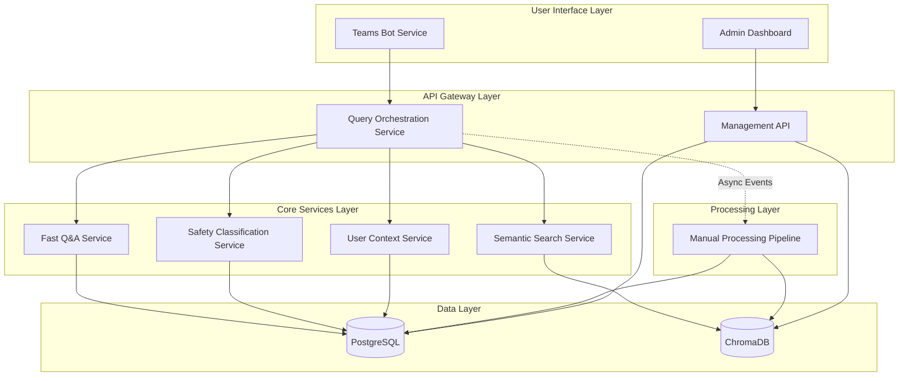

# Components

## Teams Bot Service
**Responsibility:** Microsoft Teams integration, conversation management, and user interface orchestration

**Key Interfaces:**
- `/webhook/messages` - Receives Teams messages and events
- `/webhook/auth` - Handles Teams SSO authentication flow
- `/health` - Service health check endpoint

**Dependencies:** Query Orchestration Service, User Context Service, Microsoft Graph API

**Technology Stack:** Microsoft Bot Framework SDK 4.15.0, FastAPI 0.104.1, httpx 0.25.0 for async Teams API calls

## Query Orchestration Service
**Responsibility:** Central request coordination, search strategy selection, and response composition

**Key Interfaces:**
- `POST /query/process` - Main troubleshooting query processing
- `GET /query/session/{session_id}` - Retrieve conversation history
- `POST /query/feedback` - User feedback collection

**Dependencies:** Fast Q&A Service, Semantic Search Service, Safety Classification Service, User Context Service

**Technology Stack:** FastAPI 0.104.1, SQLAlchemy 2.0.23, async processing with background tasks

## Fast Q&A Service
**Responsibility:** Sub-5 second lookup of curated troubleshooting solutions for common issues

**Key Interfaces:**
- `POST /qa/search` - Keyword-based fast lookup
- `GET /qa/entries` - Q&A content management
- `POST /qa/entries` - Add new Q&A pairs (admin)

**Dependencies:** PostgreSQL (QAEntry table), User Context Service for response adaptation

**Technology Stack:** FastAPI 0.104.1, SQLAlchemy 2.0.23, full-text search with PostgreSQL tsvector

## Semantic Search Service
**Responsibility:** Vector-based semantic search through manufacturer manuals for comprehensive coverage

**Key Interfaces:**
- `POST /semantic/search` - Natural language semantic search
- `POST /semantic/embed` - Generate embeddings for new content
- `GET /semantic/coverage` - Model coverage reporting

**Dependencies:** ChromaDB 0.4.15, sentence-transformers 2.2.2, Manual Content database

**Technology Stack:** FastAPI 0.104.1, ChromaDB 0.4.15, sentence-transformers for embeddings, async vector operations

## Safety Classification Service
**Responsibility:** Automated safety assessment and professional vs. DIY repair determination

**Key Interfaces:**
- `POST /safety/classify` - Classify repair safety level
- `GET /safety/rules` - Retrieve safety classification rules
- `POST /safety/rules` - Update safety rules (admin)

**Dependencies:** PostgreSQL (SafetyClassification table), rule engine for pattern matching

**Technology Stack:** FastAPI 0.104.1, SQLAlchemy 2.0.23, regex-based rule engine, safety pattern matching

## User Context Service
**Responsibility:** User skill level detection, preference management, and response personalization

**Key Interfaces:**
- `GET /context/user/{teams_id}` - Retrieve user context and preferences
- `POST /context/user/{teams_id}` - Update user skill level and preferences
- `POST /context/detect` - Analyze conversation for skill level detection

**Dependencies:** PostgreSQL (User table), natural language processing for skill detection

**Technology Stack:** FastAPI 0.104.1, SQLAlchemy 2.0.23, basic NLP for skill level inference

## Manual Processing Pipeline
**Responsibility:** Background processing of manufacturer manuals into searchable content

**Key Interfaces:**
- `POST /pipeline/upload` - Manual PDF upload endpoint
- `GET /pipeline/status/{job_id}` - Processing status monitoring
- `POST /pipeline/reprocess` - Trigger content reprocessing

**Dependencies:** ChromaDB, sentence-transformers, PDF processing libraries, PostgreSQL

**Technology Stack:** FastAPI 0.104.1, PyPDF2 for PDF parsing, sentence-transformers 2.2.2, background task queue

## Management API
**Responsibility:** Admin interface backend for content management and system monitoring

**Key Interfaces:**
- `GET /admin/analytics` - System usage and performance metrics
- `POST /admin/content/qa` - Q&A content management
- `GET /admin/health/services` - Service health dashboard data

**Dependencies:** All services for monitoring, PostgreSQL for analytics queries

**Technology Stack:** FastAPI 0.104.1, SQLAlchemy 2.0.23, metrics aggregation, admin authentication

## Component Diagrams

