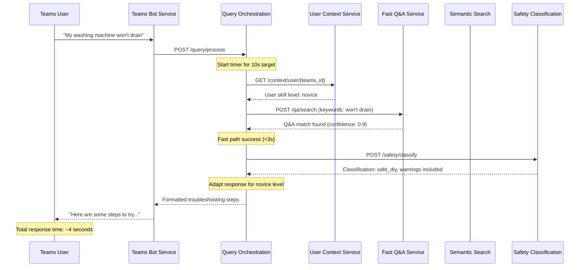
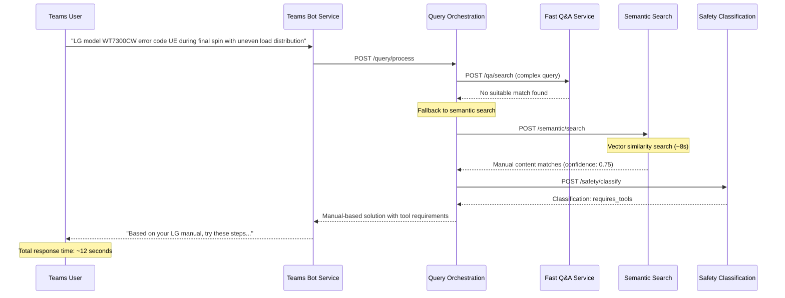
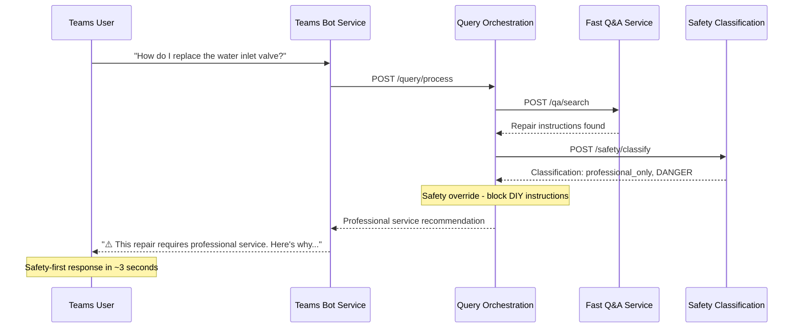

# Core Workflows

## Primary Troubleshooting Workflow

```mermaid
sequenceDiagram
    participant User as Teams User
    participant Bot as Teams Bot Service
    participant Orch as Query Orchestration
    participant Context as User Context Service
    participant FastQA as Fast Q&A Service
    participant Semantic as Semantic Search
    participant Safety as Safety Classification
    
    User->>Bot: "My washing machine won't drain"
    Bot->>Orch: POST /query/process
    
    Note over Orch: Start timer for 10s target
    
    Orch->>Context: GET /context/user/{teams_id}
    Context-->>Orch: User skill level: novice
    
    Orch->>FastQA: POST /qa/search (keywords: won't drain)
    FastQA-->>Orch: Q&A match found (confidence: 0.9)
    
    Note over Orch: Fast path success (<3s)
    
    Orch->>Safety: POST /safety/classify
    Safety-->>Orch: Classification: safe_diy, warnings included
    
    Note over Orch: Adapt response for novice level
    
    Orch-->>Bot: Formatted troubleshooting steps
    Bot-->>User: "Here are some steps to try..."
    
    Note over User: Total response time: ~4 seconds
```

## Semantic Search Fallback Workflow

```mermaid
sequenceDiagram
    participant User as Teams User
    participant Bot as Teams Bot Service
    participant Orch as Query Orchestration
    participant FastQA as Fast Q&A Service
    participant Semantic as Semantic Search
    participant Safety as Safety Classification
    
    User->>Bot: "LG model WT7300CW error code UE during final spin with uneven load distribution"
    Bot->>Orch: POST /query/process
    
    Orch->>FastQA: POST /qa/search (complex query)
    FastQA-->>Orch: No suitable match found
    
    Note over Orch: Fallback to semantic search
    
    Orch->>Semantic: POST /semantic/search
    Note over Semantic: Vector similarity search (~8s)
    Semantic-->>Orch: Manual content matches (confidence: 0.75)
    
    Orch->>Safety: POST /safety/classify
    Safety-->>Orch: Classification: requires_tools
    
    Orch-->>Bot: Manual-based solution with tool requirements
    Bot-->>User: "Based on your LG manual, try these steps..."
    
    Note over User: Total response time: ~12 seconds
```

## Safety Override Workflow

```mermaid
sequenceDiagram
    participant User as Teams User
    participant Bot as Teams Bot Service
    participant Orch as Query Orchestration
    participant FastQA as Fast Q&A Service
    participant Safety as Safety Classification
    
    User->>Bot: "How do I replace the water inlet valve?"
    Bot->>Orch: POST /query/process
    
    Orch->>FastQA: POST /qa/search
    FastQA-->>Orch: Repair instructions found
    
    Orch->>Safety: POST /safety/classify
    Safety-->>Orch: Classification: professional_only, DANGER
    
    Note over Orch: Safety override - block DIY instructions
    
    Orch-->>Bot: Professional service recommendation
    Bot-->>User: "⚠️ This repair requires professional service. Here's why..."
    
    Note over User: Safety-first response in ~3 seconds
```
