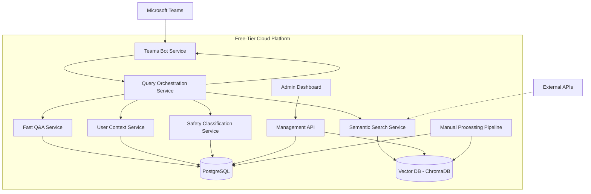

# High Level Architecture

## Technical Summary

The RAG-Powered Washing Machine Troubleshooting Assistant employs a **microservices-within-monorepo architecture** utilizing a tiered search strategy combining fast Q&A lookup with semantic manual search fallback. The system leverages **FastAPI** for high-performance async backend services, **PostgreSQL** for structured data with vector embedding support, and **ChromaDB** for semantic search capabilities. Core architectural patterns include **Repository Pattern** for data abstraction, **Strategy Pattern** for search orchestration, and **Circuit Breaker Pattern** for external API resilience. This architecture directly supports PRD goals of sub-10 second response times, 85% accuracy rates, and seamless Microsoft Teams integration while operating within free-tier infrastructure constraints.

## High Level Overview

1. **Architectural Style:** **Microservices within Monorepo** - Separate services for search, user context, safety classification, and bot management while maintaining deployment simplicity and free-tier optimization
2. **Repository Structure:** **Monorepo** as specified in PRD - Single repository containing Teams bot, API backend, manual processing pipeline, and admin interface for simplified dependency management and CI/CD
3. **Service Architecture:** **Event-driven microservices** with REST API communication and shared PostgreSQL data layer, enabling independent scaling while maintaining deployment simplicity
4. **Primary User Flow:** Teams user query → Bot Framework → Query orchestration → Tiered search (Fast Q&A → Semantic fallback) → Safety classification → Contextual response adaptation → Teams response
5. **Key Architectural Decisions:**
   - **Tiered Search Strategy:** Fast Q&A lookup (sub-5 seconds) with semantic search fallback (15 seconds) to balance speed and coverage
   - **Safety-First Design:** All responses pass through safety classification before delivery to users
   - **Context-Aware Responses:** User skill level detection drives response complexity and safety warning emphasis

## High Level Project Diagram

## Architectural and Design Patterns

- **Microservices Architecture:** Independent services for search, safety, context management - *Rationale:* Enables independent scaling of compute-intensive search operations while maintaining deployment simplicity for free-tier constraints

- **Repository Pattern:** Abstract data access logic across PostgreSQL and vector databases - *Rationale:* Enables testing isolation, database migration flexibility, and consistent data access patterns across microservices

- **Strategy Pattern:** Pluggable search algorithms (fast Q&A vs semantic search) - *Rationale:* Supports PRD requirement for tiered search approach and enables A/B testing different search strategies

- **Circuit Breaker Pattern:** Resilient external API calls with fallback mechanisms - *Rationale:* Ensures sub-10 second response times even when external services fail, maintaining system availability

- **Command Query Responsibility Segregation (CQRS):** Separate read/write models for user analytics vs. real-time queries - *Rationale:* Optimizes query performance for sub-10 second target while enabling comprehensive analytics tracking

- **Adapter Pattern:** Standardized interfaces for multiple vector databases (ChromaDB/Weaviate) - *Rationale:* Provides flexibility to switch vector databases based on free-tier availability and performance benchmarks
